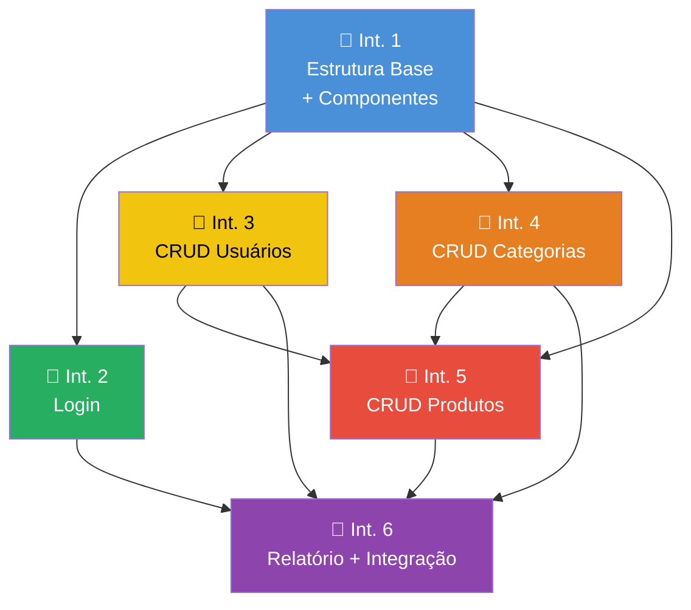

# 📋 Plano de Divisão de Tarefas — Projeto React N2

## Visão Geral do Projeto

Converter um projeto HTML/CSS para uma aplicação React contendo:
- Sistema de Login simulado
- 3 CRUDs completos
- Relatório com JOIN entre entidades

**Equipe:** 6 integrantes

---

## 🏗️ Arquitetura Sugerida

Antes de dividir as tarefas, é importante que **todos** concordem com a estrutura do projeto:

```
src/
├── components/          # Componentes reutilizáveis (Tabela, Formulário, Modal, etc.)
├── pages/               # Páginas (Login, CRUDs, Relatório)
│   ├── Login/
│   ├── Usuarios/
│   ├── Produtos/
│   ├── Categorias/
│   └── Relatorio/
├── contexts/            # Context API (AuthContext, DataContext)
├── routes/              # Configuração de rotas e proteção
├── utils/               # Funções auxiliares
├── App.jsx
├── App.css
└── main.jsx
```

## 🎯 Entidades Sugeridas

> [!TIP]
> As entidades abaixo foram escolhidas para facilitar o JOIN do relatório. O grupo pode alterar, desde que mantenha pelo menos um relacionamento entre elas.

| Entidade     | Campos Sugeridos                              | Relacionamento        |
|-------------|-----------------------------------------------|-----------------------|
| **Usuários** | id, nome, email, telefone                     | —                     |
| **Categorias** | id, nome, descricao                        | —                     |
| **Produtos** | id, nome, preco, categoriaId, usuarioId       | FK → Categorias, Usuários |

**JOINs possíveis:**
- Produto + Categoria (qual categoria cada produto pertence)
- Produto + Usuário (quem cadastrou cada produto)

---

## 👥 Divisão por Integrante

### 🔵 Integrante 1 — Estrutura Base + Roteamento + Componentes Compartilhados

**Papel:** Responsável pela fundação do projeto. Todo o time depende deste trabalho para começar.

**Tarefas:**
- [ ] Criar o projeto React (Vite + React)
- [ ] Configurar o `react-router-dom` com todas as rotas
- [ ] Criar o layout principal (`Header`, `Sidebar`/`Navbar`, `Footer`)
- [ ] Criar o componente de **Rota Protegida** (`PrivateRoute`) que bloqueia acesso sem login
- [ ] Definir a estrutura de pastas e padrão de organização
- [ ] Criar componentes reutilizáveis base:
  - `Tabela` genérica (recebe colunas e dados via props)
  - `Botão` estilizado
  - `InputField` com label e validação visual
  - `Modal` de confirmação (para exclusão)
- [ ] Configurar a estilização global (CSS base, variáveis, fontes)

**Critérios de avaliação atendidos:**
- Proteção de rotas (0,1 pt do Login)
- Componente reutilizável (0,15 pt do CRUD 2)
- Código **não** concentrado no `App.jsx` (evita penalidade de –1,0)

> [!IMPORTANT]
> Este integrante deve ser o **primeiro a entregar**, pois os demais dependem da estrutura base. Idealmente, deve criar o repositório, configurar o projeto e fazer o push inicial antes que os outros comecem.

---

### 🟢 Integrante 2 — Sistema de Login Completo

**Parte da avaliação:** PARTE 1 — Sistema de Login (0,5 ponto)

**Tarefas:**
- [ ] Criar o `AuthContext` com Context API
  - Estado do usuário logado (`useState`)
  - Funções `login()` e `logout()`
  - Persistência da sessão com `localStorage`
- [ ] Criar a **Página de Login** (`/login`)
  - Campos: e-mail e senha
  - Validação de campos obrigatórios (não pode submeter vazio)
  - Validação de formato de e-mail
  - Mensagens de erro visuais
  - Simulação de autenticação (comparar com dados fixos ou do localStorage)
- [ ] Implementar o **Logout**
  - Botão de logout no Header/Navbar
  - Limpa sessão e redireciona para `/login`
- [ ] Implementar **controle de sessão**
  - Manter usuário logado ao recarregar a página (ler do localStorage)
  - Redirecionar para login se sessão expirada/inexistente
- [ ] Criar a lógica do `PrivateRoute` (em conjunto com Integrante 1)
- [ ] Criar usuários padrão para teste (ex: `admin@email.com` / `1234`)

**Critérios de avaliação atendidos:**

| Critério | Pontos |
|----------|--------|
| Formulário funcional e validações | 0,2 |
| Controle de sessão e logout | 0,2 |
| Proteção de rotas (com Int. 1) | 0,1 |
| **Total** | **0,5** |

---

### 🟡 Integrante 3 — CRUD 1: Usuários

**Parte da avaliação:** CRUD 1 (0,5 ponto)

**Tarefas:**
- [ ] Criar a **Página de Listagem de Usuários** (`/usuarios`)
  - Renderizar lista dinâmica usando `map()`
  - Exibir dados em tabela (usar componente `Tabela` do Int. 1)
  - Botões de Editar e Excluir em cada linha
- [ ] Criar o **Formulário de Cadastro** (`/usuarios/novo`)
  - Campos: nome, e-mail, telefone
  - Validação de campos obrigatórios
  - Validação de formato (e-mail válido, telefone numérico)
  - Mensagens de erro
  - Ao salvar, adicionar ao estado e redirecionar para listagem
- [ ] Implementar **Edição** (`/usuarios/editar/:id`)
  - Preencher formulário com dados existentes
  - Atualizar no estado ao salvar
- [ ] Implementar **Exclusão**
  - Modal de confirmação antes de excluir
  - Remover do estado
- [ ] Gerenciar estado com `useState`
- [ ] Persistir dados no `localStorage`

**Critérios de avaliação atendidos:**

| Critério | Pontos |
|----------|--------|
| Cadastro (Create) com validação | 0,15 |
| Listagem dinâmica (Read) com `map()` | 0,15 |
| Edição e exclusão funcionais | 0,20 |
| **Total** | **0,5** |

---

### 🟠 Integrante 4 — CRUD 2: Categorias

**Parte da avaliação:** CRUD 2 (0,5 ponto)

**Tarefas:**
- [ ] Criar a **Página de Listagem de Categorias** (`/categorias`)
  - Renderizar usando `map()`
  - **Usar o componente reutilizável `Tabela`** criado pelo Int. 1
  - Botões de ação em cada linha
- [ ] Criar o **Formulário de Cadastro** (`/categorias/novo`)
  - Campos: nome, descrição
  - Cadastro funcional com validação básica
- [ ] Implementar **Edição** (`/categorias/editar/:id`)
  - Update correto no estado
- [ ] Implementar **Exclusão**
  - Delete funcional com confirmação
- [ ] Gerenciar estado com `useState`
- [ ] Persistir dados no `localStorage`

**Critérios de avaliação atendidos:**

| Critério | Pontos |
|----------|--------|
| Cadastro funcional | 0,15 |
| Listagem com componente reutilizável | 0,15 |
| Update e Delete corretos | 0,20 |
| **Total** | **0,5** |

> [!NOTE]
> O diferencial deste CRUD é o uso explícito de **componente reutilizável** na listagem. O Integrante 4 deve coordenar com o Integrante 1 para garantir que o componente `Tabela` atenda suas necessidades.

---

### 🔴 Integrante 5 — CRUD 3: Produtos

**Parte da avaliação:** CRUD 3 (0,5 ponto)

**Tarefas:**
- [ ] Criar a **Página de Listagem de Produtos** (`/produtos`)
  - Renderizar usando `map()`
  - Exibir nome da categoria (precisa resolver a FK)
  - Exibir nome do usuário que cadastrou
- [ ] Criar o **Formulário de Cadastro** (`/produtos/novo`)
  - Campos: nome, preço, categoriaId (select/dropdown), usuarioId (select/dropdown)
  - Dropdowns populados com dados de Categorias e Usuários
  - Validação completa
- [ ] Implementar **Edição** (`/produtos/editar/:id`)
- [ ] Implementar **Exclusão** com confirmação
- [ ] **Uso correto de `useState`** para todo o gerenciamento de estado
- [ ] **Persistência com `localStorage`** ou estado global (Context API)
  - Salvar produtos no localStorage
  - Carregar ao iniciar a aplicação

**Critérios de avaliação atendidos:**

| Critério | Pontos |
|----------|--------|
| Uso correto de estado (`useState`) | 0,15 |
| Persistência dos dados (localStorage ou estado global) | 0,15 |
| CRUD completo e funcional | 0,20 |
| **Total** | **0,5** |

> [!IMPORTANT]
> Este CRUD é o mais complexo pois envolve **chaves estrangeiras** (categoriaId, usuarioId). O Integrante 5 precisa acessar os dados de Categorias (Int. 4) e Usuários (Int. 3). Recomenda-se o uso de um **DataContext** compartilhado ou combinar que todos usem as mesmas chaves no `localStorage`.

---

### 🟣 Integrante 6 — Relatório com JOIN + Integração e Revisão Final

**Parte da avaliação:** PARTE 3 — Relatório com JOIN (0,5 ponto)

**Tarefas — Relatório:**
- [ ] Criar a **Página de Relatório** (`/relatorio`)
- [ ] Implementar o **JOIN entre entidades** usando JavaScript puro:
  - Combinar Produtos + Categorias (mostrar nome da categoria de cada produto)
  - Combinar Produtos + Usuários (mostrar quem cadastrou cada produto)
  - Usar `map()` + `find()` para resolver as chaves estrangeiras
- [ ] Exibir o relatório em **tabela clara e organizada**
  - Colunas: Nome do Produto, Preço, Categoria, Cadastrado por
  - Filtros opcionais (por categoria, por faixa de preço)
- [ ] Garantir que o **código esteja organizado e compreensível**
  - Funções auxiliares bem nomeadas
  - Comentários explicativos no JOIN
  - Separação clara da lógica de dados e da renderização

**Tarefas — Integração e Revisão:**
- [ ] Testar o fluxo completo da aplicação (login → CRUDs → relatório → logout)
- [ ] Verificar que todos os CRUDs compartilham dados corretamente
- [ ] Verificar que **nenhum código está todo concentrado no `App.jsx`** (penalidade –1,0)
- [ ] Verificar que todos os CRUDs usam `map()` e `useState` (penalidade –0,25)
- [ ] Garantir que o projeto **executa sem erros** (penalidade –1,5)
- [ ] Fazer ajustes finais de estilização e consistência visual
- [ ] Preparar o README do projeto com instruções de execução

**Critérios de avaliação atendidos:**

| Critério | Pontos |
|----------|--------|
| JOIN corretamente implementado | 0,25 |
| Exibição clara do relatório | 0,15 |
| Organização do código | 0,10 |
| **Total** | **0,5** |

---

## 🔄 Fluxo de Dependências



> [!WARNING]
> O **Integrante 1** é a dependência principal. Ele deve entregar a estrutura base o mais rápido possível. Os Integrantes 2, 3 e 4 podem trabalhar em paralelo após isso. O Integrante 5 depende de 3 e 4 (para os selects). O Integrante 6 depende de todos.

---

## 📑 Resumo da Divisão

| Integrante | Responsabilidade | Parte da Avaliação | Pontos |
|:---:|---|---|:---:|
| **1** | Estrutura base, rotas, componentes reutilizáveis | Suporte a todas as partes | — |
| **2** | Sistema de Login completo | Parte 1 | 0,5 |
| **3** | CRUD 1 — Usuários | Parte 2 (CRUD 1) | 0,5 |
| **4** | CRUD 2 — Categorias | Parte 2 (CRUD 2) | 0,5 |
| **5** | CRUD 3 — Produtos | Parte 2 (CRUD 3) | 0,5 |
| **6** | Relatório com JOIN + Integração | Parte 3 | 0,5 |

**Total:** 2,5 pontos

---

## 📌 Combinados Importantes para o Grupo

> [!CAUTION]
> Estes pontos devem ser alinhados antes de começar a desenvolver:

1. **Padrão de dados no localStorage:** Definir as chaves que cada CRUD vai usar (ex: `usuarios`, `categorias`, `produtos`)
2. **Estrutura dos objetos:** Todos devem usar o mesmo formato de ID (ex: `Date.now()` ou `crypto.randomUUID()`)
3. **Chaves estrangeiras:** Produtos deve ter `categoriaId` e `usuarioId` que referenciam os IDs reais das outras entidades
4. **Branches no Git:** Cada integrante deve trabalhar em sua própria branch e fazer merge via Pull Request
5. **Convenção de nomes:** Definir padrão para nomes de componentes, arquivos e variáveis (ex: PascalCase para componentes, camelCase para variáveis)
6. **CSS:** Definir se cada página terá seu próprio `.css` ou se usarão CSS Modules / styled-components
7. **Comunicação:** O Integrante 6 (integrador) deve acompanhar o progresso de todos para antecipar problemas

---

## ✅ Checklist Anti-Penalidades

| Penalidade | Valor | Como Evitar | Responsável |
|---|:---:|---|:---:|
| Projeto não executa | –1,5 | Testar `npm run dev` antes da entrega | Int. 6 |
| CRUD sem `map()` ou sem estado | –0,25 | Usar `map()` em TODAS as listagens e `useState` | Int. 3, 4, 5 |
| Login inexistente ou não funcional | zera login | Testar fluxo completo de login/logout | Int. 2 |
| Código todo no `App.jsx` | –1,0 | Separar em componentes e páginas | Int. 1, todos |
